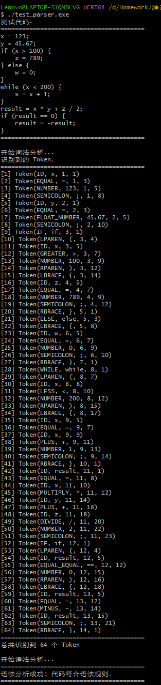

# LL(1) 语法分析器生成器 (Parser Generator)

一个基于经典编译原理算法的 LL(1) 语法分析器生成器，能够根据上下文无关文法规则自动生成高效的 C++ 递归下降语法分析器代码。

## 功能特性

- **自动生成语法分析器**：根据文法规则文件自动生成 C++ LL(1) 递归下降解析器代码
- **LL(1) 文法支持**：支持标准的上下文无关文法（CFG）
- **经典算法实现**：
  - FIRST 集合计算（迭代算法）
  - FOLLOW 集合计算（迭代算法）
  - LL(1) 预测分析表构建
  - 冲突检测与处理（dangling else 问题）
- **空产生式支持**：正确处理 ε（空产生式）
- **错误报告**：提供详细的语法错误位置信息
- **与词法分析器集成**：与生成的词法分析器无缝配合

## 项目结构

```
parser-generator/
├── main.cpp                    # 主程序入口
├── GrammarParser.h/cpp         # 文法规则文件解析器
├── FirstCalculator.h/cpp       # FIRST 集合计算器
├── FollowCalculator.h/cpp      # FOLLOW 集合计算器
├── ParsingTable.h/cpp          # 预测分析表构建器
├── ParserCodeGenerator.h/cpp   # 代码生成器
├── grammar_rules.txt           # 文法规则文件
├── test_parser.cpp             # 测试程序
└── generated_parser.cpp        # 生成的语法分析器（自动生成）
```

## 编译方法

### 编译语法分析器生成器

```bash
cd parser-generator
g++ -std=c++11 FirstCalculator.cpp FollowCalculator.cpp GrammarParser.cpp ParsingTable.cpp ParserCodeGenerator.cpp main.cpp ../lexer-generator/FileParser.cpp -o parser_generator.exe
```

### 运行生成器

```bash
./parser_generator.exe
```

读取 `grammar_rules.txt` 和 `../lexer-generator/lexer_rules.txt`，并生成 `generated_parser.cpp`。

### 编译测试程序

```bash
g++ -std=c++11 test_parser.cpp -o test_parser.exe
```

### 运行测试

```bash
./test_parser.exe
```

## 规则文件格式

### 语法规则文件 (`grammar_rules.txt`)

规则文件使用标准的上下文无关文法（CFG）格式：

```
%start StartSymbol

NonTerminal -> Production1
            | Production2
            | Production3

NonTerminal2 -> Symbol1 Symbol2 Symbol3
              | ε
```

#### 格式说明

- `%start SymbolName`：指定开始符号（可选，如果省略则使用第一个产生式的左侧）
- `NonTerminal -> Production`：产生式规则
- `|`：分隔多个候选式（同一个非终结符的不同产生式）
- `ε`：空产生式（也可以使用空行表示）
- 终结符：必须是词法规则文件中定义的 token 类型（如 `ID`、`NUMBER`、`IF` 等）
- 非终结符：未在词法规则中定义的符号被视为非终结符

#### 示例规则文件

```txt
# ===============================
# Grammar Rules (LL(1))
# ===============================

%start Program

# ---------- Program Structure ----------

Program        -> StmtList

StmtList       -> Stmt StmtList
               | ε

# ---------- Statements ----------

Stmt           -> AssignStmt
               | IfStmt
               | WhileStmt
               | Block

AssignStmt     -> ID EQUAL Expr SEMICOLON

IfStmt         -> IF LPAREN Expr RPAREN Stmt ElsePart

ElsePart       -> ELSE Stmt
               | ε

WhileStmt      -> WHILE LPAREN Expr RPAREN Stmt

Block          -> LBRACE StmtList RBRACE

# ---------- Expressions ----------

Expr           -> RelExpr

RelExpr        -> AddExpr RelExpr'

RelExpr'       -> EQUAL_EQUAL AddExpr RelExpr'
               | NOT_EQUAL AddExpr RelExpr'
               | GREATER AddExpr RelExpr'
               | LESS AddExpr RelExpr'
               | GREATER_EQUAL AddExpr RelExpr'
               | LESS_EQUAL AddExpr RelExpr'
               | ε

AddExpr        -> MulExpr AddExpr'

AddExpr'       -> PLUS MulExpr AddExpr'
               | MINUS MulExpr AddExpr'
               | ε

MulExpr        -> UnaryExpr MulExpr'

MulExpr'       -> MULTIPLY UnaryExpr MulExpr'
               | DIVIDE UnaryExpr MulExpr'
               | MOD UnaryExpr MulExpr'
               | ε

UnaryExpr      -> MINUS UnaryExpr
               | Primary

Primary        -> NUMBER
               | FLOAT_NUMBER
               | ID
               | LPAREN Expr RPAREN
```

## LL(1) 文法要求

生成的语法分析器要求输入文法是 LL(1) 的。一个文法是 LL(1) 的，当且仅当：

1. **无左递归**：不能有 `A -> Aα` 这样的直接左递归
2. **无 FIRST-FOLLOW 冲突**：
   - 对于非终结符 A 的每个产生式 `A -> α | β`：
     - `FIRST(α) ∩ FIRST(β) = ∅`
     - 如果 `ε ∈ FIRST(α)`，则 `FIRST(β) ∩ FOLLOW(A) = ∅`

### 左递归消除

如果文法包含左递归（如 `Expr -> Expr + Term`），需要转换为右递归（如 `Expr -> Term Expr'`，`Expr' -> + Term Expr' | ε`）。

### 冲突处理

当预测分析表中出现冲突时，生成器会尝试自动处理：

- **ε vs 非ε 冲突**：优先选择非ε产生式（用于解决 dangling else 问题）
- **其他冲突**：报告错误，表示文法不是 LL(1)

## 使用示例

### 1. 准备词法规则文件

首先确保 `../lexer-generator/lexer_rules.txt` 存在并定义了所需的 token 类型。

### 2. 定义语法规则文件

创建 `grammar_rules.txt`（参考上面的示例）。

### 3. 生成语法分析器

```bash
./parser_generator.exe
```

### 4. 使用生成的语法分析器

在代码中使用生成的解析器（需要先进行词法分析）：

```cpp
// 先包含 lexer（定义了 Token 和 Lexer）
#include "../lexer-generator/generated_lexer.cpp"
// 定义 TOKEN_DEFINED 防止 parser 中重复定义 Token
#define TOKEN_DEFINED
// 再包含 parser（使用已定义的 Token）
#include "generated_parser.cpp"

int main() {
    string code = "x = 123; if (x > 100) { y = 456; }";
    
    // 第一步：词法分析
    Lexer lexer(code);
    vector<Token*> tokens = lexer.tokenize();
    
    // 第二步：语法分析
    try {
        Parser parser(tokens);
        parser.parse();
        cout << "语法分析成功！" << endl;
    } catch (const exception &e) {
        cerr << "语法错误: " << e.what() << endl;
    }
    
    // 清理内存
    for (auto token : tokens) {
        delete token;
    }
    
    return 0;
}
```

### 5. 测试结果



## 技术实现

### 1. 文法解析

使用 `GrammarParser` 解析文法规则文件，识别终结符和非终结符，构建文法数据结构。

### 2. FIRST 集合计算

使用**迭代算法**计算所有符号的 FIRST 集合：
- 对于终结符 `a`：`FIRST(a) = {a}`
- 对于非终结符 `A`：迭代计算直到收敛，处理空产生式的情况

### 3. FOLLOW 集合计算

使用**迭代算法**计算所有非终结符的 FOLLOW 集合：
- 初始化：`$ ∈ FOLLOW(开始符号)`
- 迭代应用 FOLLOW 规则直到收敛

### 4. 预测分析表构建

根据 FIRST 和 FOLLOW 集合构建 LL(1) 预测分析表：
- **规则1**：对每个 `a ∈ FIRST(α)`，将 `A -> α` 填入 `M[A, a]`
- **规则2**：如果 `ε ∈ FIRST(α)`，对每个 `b ∈ FOLLOW(A)`，将 `A -> α` 填入 `M[A, b]`

### 5. 代码生成

根据预测分析表生成递归下降解析器代码：
- 为每个非终结符生成一个解析方法
- 使用 lookahead token 选择产生式
- 处理终结符（consume）和非终结符（递归调用）

## 支持的语法特性

### 产生式格式

- **多候选式**：使用 `|` 分隔
- **空产生式**：使用 `ε` 或空行
- **多行产生式**：可以使用 `|` 开头继续上一行的产生式

### 终结符

终结符必须是词法规则文件中定义的 token 类型，例如：
- `ID`、`NUMBER`、`FLOAT_NUMBER`
- `IF`、`WHILE`、`ELSE`
- `PLUS`、`MINUS`、`MULTIPLY`、`DIVIDE`
- `LPAREN`、`RPAREN`、`LBRACE`、`RBRACE`
- `SEMICOLON`、`EQUAL`、`EQUAL_EQUAL`
- 等等

### 非终结符

所有在词法规则中未定义的符号都被视为非终结符。非终结符名称可以包含单引号（如 `Expr'`），在生成的代码中会被转换为下划线（如 `Expr_`）。

## 注意事项

1. **词法规则依赖**：语法规则中使用的终结符必须在词法规则文件中定义
2. **LL(1) 要求**：输入的文法必须是 LL(1) 的，否则可能无法生成正确的解析器
3. **左递归消除**：如果文法包含左递归，需要先转换为右递归
4. **Token 定义冲突**：在使用生成的 parser 时，需要先包含 lexer 并定义 `TOKEN_DEFINED` 防止 Token 结构体重复定义
5. **内存管理**：使用生成的 parser 时，需要手动管理 Token 的内存（delete）
6. **错误处理**：解析失败时会抛出 `runtime_error`，需要捕获处理

## 与词法分析器的配合

本语法分析器生成器设计为与词法分析器生成器配合使用：

1. 使用词法分析器生成器生成 `generated_lexer.cpp`
2. 使用语法分析器生成器生成 `generated_parser.cpp`
3. 在应用代码中先进行词法分析，再进行语法分析

完整的编译流程示例：

```bash
# 1. 生成词法分析器
cd lexer-generator
g++ -std=c++11 *.cpp -o lexer_generator.exe
./lexer_generator.exe

# 2. 生成语法分析器
cd ../parser-generator
g++ -std=c++11 FirstCalculator.cpp FollowCalculator.cpp GrammarParser.cpp ParsingTable.cpp ParserCodeGenerator.cpp main.cpp ../lexer-generator/FileParser.cpp -o parser_generator.exe
./parser_generator.exe

# 3. 编译测试程序
g++ -std=c++11 test_parser.cpp -o test_parser.exe
./test_parser.exe
```

## 限制与未来改进

- **当前限制**：
  - 仅支持 LL(1) 文法
  - 不支持语义动作（仅做语法检查）
  - 不支持左递归（需要手动转换）
  
- **可能的改进方向**：
  - 支持 LR 文法
  - 支持语义动作和 AST 生成
  - 自动左递归消除
  - 更好的错误恢复机制
